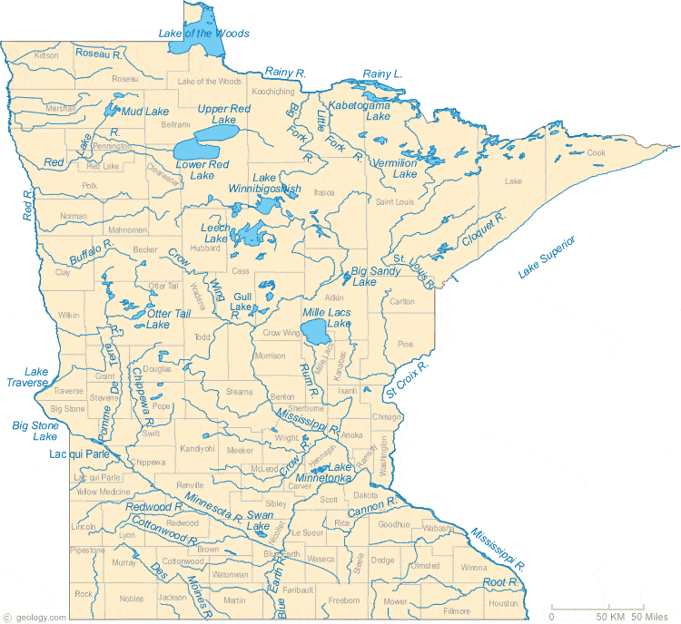

```{r setup, include=FALSE}
knitr::opts_chunk$set(echo = FALSE
                      , results = 'asis'
                      , warning = FALSE
                      , message = FALSE)
```

This R-based tool calculates Biological Condition Gradient (BCG) and Index of Biological Integrity (IBI) scores for macroinvertebrate and fish assemblages in Minnesota streams.




*Last updated 2024-07-02*
