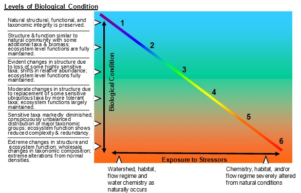

```{r setup, include=FALSE}
knitr::opts_chunk$set(echo = FALSE
                      , results = 'asis'
                      , warning = FALSE
                      , message = FALSE)
```

# Introduction

The MN Biological Condition Gradient (BCG) is divided into six levels of
biological condition along a generalized stressor-response curve,
ranging from observable biological conditions found at no or low levels
of stressors (level 1) to those found at high levels of stressors (level
6) (Figure 1)
(<a href="https://www.epa.gov/sites/default/files/2016-02/documents/bcg-practioners-guide-report.pdf" target="blank">USEPA
2016</a>).

Lists of Index Classes and links to Rules tables can be found on the bug
and fish BCG subtabs. For more detailed information, see Gerritsen et
al. (2017) and Gerritsen et al. (2012) on the References page.

For guidance on how to interpret the results, see the Metadata files on
the Instructions page.

IMPORTANT: Data must be collected using MPCA field and laboratory
protocols (see MPCA 2017 reports on the References page).

{width="75%"}

Figure 1. Conceptual diagram of the Biological Condition Gradient (BCG)
model.

Some rules tables in the reports on the References page. You may notice
some differences between the MPCA reports and metadata files. For
example, some of the coldwater metrics in the fish BCG are coded
differently. Use the Metadata.

------------------------------------------------------------------------

*Last updated 2024-07-29*
