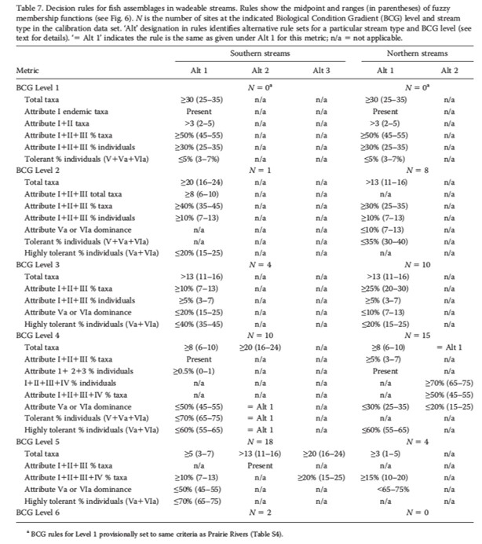

```{r setup, include=FALSE}
knitr::opts_chunk$set(echo = FALSE
                      , results = 'asis'
                      , warning = FALSE
                      , message = FALSE)
```

# Calculation - Fish BCG

Example of BCG decision rules for fish assemblages in high-gradient streams (riffle–run habitat) (Table 7 from Gerritsen et al. 2017). To see BCG rules for all 11 BCG fish classes, see Gerritsen et al. 2012 [<a href="https://github.com/leppott/MNcalc/raw/main/inst/apps/MNcalc/www/links/BCG_FishRules_Gerritsen2012.pdf" target="blank">PDF</a>] and the output file ‘BCG_3metrules.’

{width="75%}

------------------------------------------------------------------------

*Last updated 2024-10-03*
