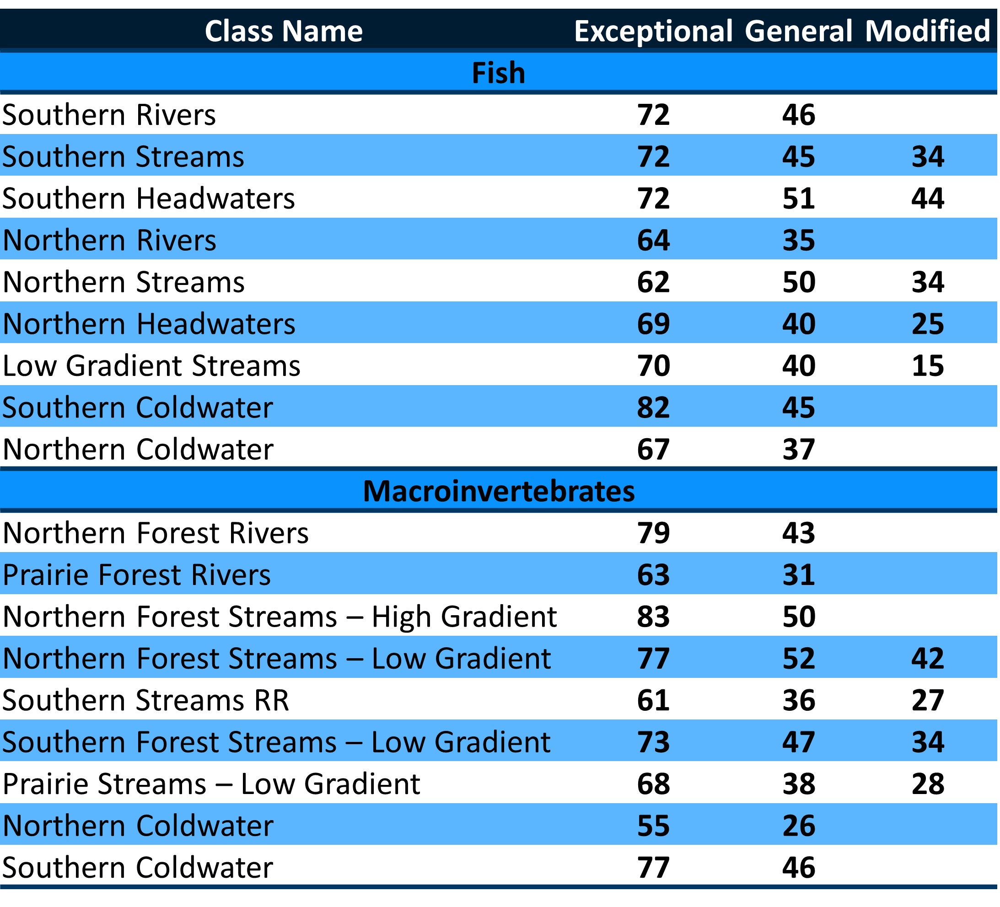

```{r setup, include=FALSE}
knitr::opts_chunk$set(echo = FALSE
                      , results = 'asis'
                      , warning = FALSE
                      , message = FALSE)
```

# Calculation – IBI

The Index of Biotic Integrity (IBI) is one of the primary tools used by
the MPCA to determine if streams are meeting their aquatic life use
goals. MPCA has developed numeric biocriteria for the IBI, with
thresholds for Exceptional, General, and Modified Uses (Table 1; (MPCA
2016, Bouchard et al. 2016). The IBIs are comprised of biological
metrics that were found to be responsive to a general stressor gradient.
Metrics for each sample are scored and averaged. The IBI scoring scale
ranges from 0 (worst) to 100 (best).

Lists of Index Classes and links to tables with metric information can
be found on the bug and fish IBI subtabs. For more detailed information,
see the MPCA 2014 and 2017 reports on the References page.

For guidance on how to interpret the results, see the Metadata page.

IMPORTANT: Data must be collected using MPCA field and laboratory
protocols (see MPCA 2017 reports on the References page).

Table 1. Biological criteria for Exceptional, General, and Modified
Uses.

{width="75%"}

------------------------------------------------------------------------

*Last updated 2024-07-15*
