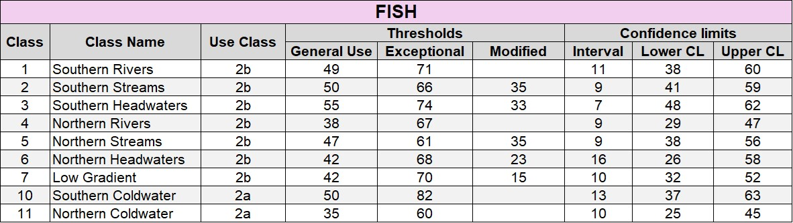
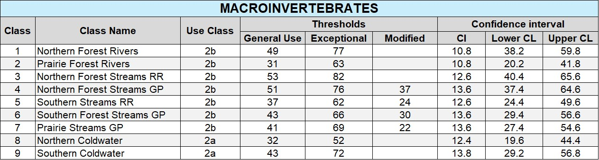

```{r setup, include=FALSE}
knitr::opts_chunk$set(echo = FALSE
                      , results = 'asis'
                      , warning = FALSE
                      , message = FALSE)
```

# Calculation – IBI

The Index of Biotic Integrity (IBI) is one of the primary tools used by the MPCA
to determine if streams are meeting their aquatic life use goals. The IBIs are
comprised of biological metrics that were found to be responsive to a general
stressor gradient. Examples of bug and fish IBI input metrics and scoring 
formulas can be found in the bug and fish subtabs. The IBI scoring scale ranges
from 0 (worst) to 100 (best). 

The Shiny app will perform the following steps:

1.	Mark non-distinct taxa (excluded from richness metrics)

2.	Calculate metric values for each sample

3.	Calculate metric scores for each sample

4.	Calculate overall IBI score for each sample

MPCA has developed numeric biocriteria for the IBI, with class-specific 
thresholds for Exceptional, General, and Modified Uses for fish (Table 1) and
macroinvertebrates (Table 2) that were informed by the BCG model (Bouchard et 
al. 2016).

Table 1. Biological criteria for Exceptional, General, and Modified Uses for the
fish IBI, with upper and lower Confidence limits (CL) around the General Use
threshold.
{width="75%"}

Table 2. Biological criteria for the macroinvertebrate IBI.
{width="75%"}

IMPORTANT: Data must be collected using MPCA field and laboratory protocols (see MPCA 2017 reports on the References page).

For more detailed information, see the MPCA 2014 and 2017 reports on the References page.

------------------------------------------------------------------------

*Last updated 2024-10-03*
