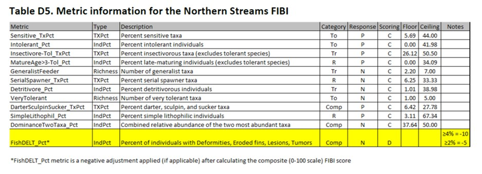

```{r setup, include=FALSE}
knitr::opts_chunk$set(echo = FALSE
                      , results = 'asis'
                      , warning = FALSE
                      , message = FALSE)
```

# Calculation - Fish IBI

Example of IBI metric information for fish assemblages in northern streams 
(Table D5 from Fish Protocols & IBI; MPCA 2017).

To see IBI metric information for all fish classes, see MPCA 2017 
[<a href="https://github.com/leppott/MNcalc/raw/main/inst/apps/MNcalc/www/links/FishIBI_2017_MetricInformation.pdf" target="blank">PDF</a>] 
and the output file ‘IBI_3metrules.’

{width="75%"}

---

*Last updated 2024-10-03*
