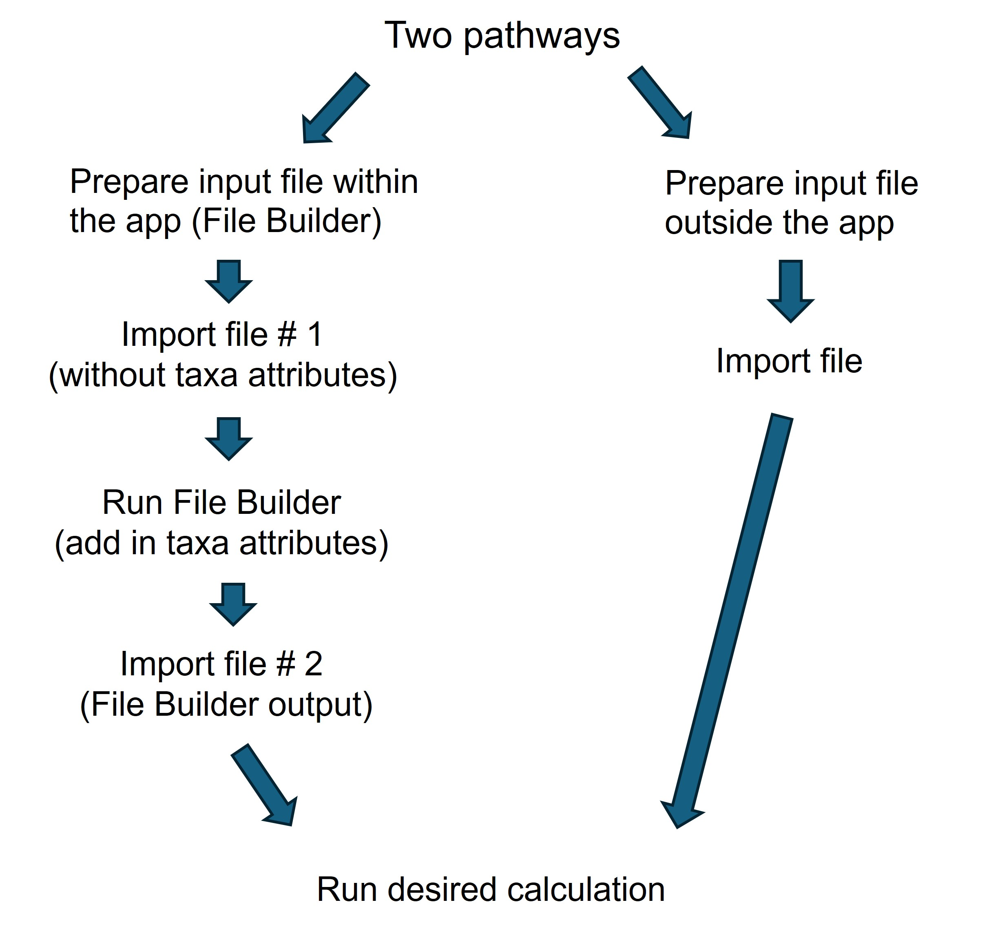

```{r setup, include=FALSE}
knitr::opts_chunk$set(echo = FALSE
                      , results = 'asis'
                      , warning = FALSE
                      , message = FALSE)
```

# **Preparing input files**

Input files must be comma-separated values (CSV). There are two options
for preparing input files:

**Option 1**: Use the **Within the App: File Builder** function. Why?

-   Fewer required fields

-   Ensures use of proper Operational Taxonomic Units (OTUs) and
    attributes for the calculations

-   More flexibility on names of column headings

**Option 2**: Generate a file outside of the Shiny app that is ready to
go (i.e., has all the required fields, with exact column heading names).
See the **Outside the App** subtab for details.

After you prepare the input file, go to the **Import Files** tab, upload
your input file, and calculate the BCG in the **Calculation** tab.

{width="50%"}
