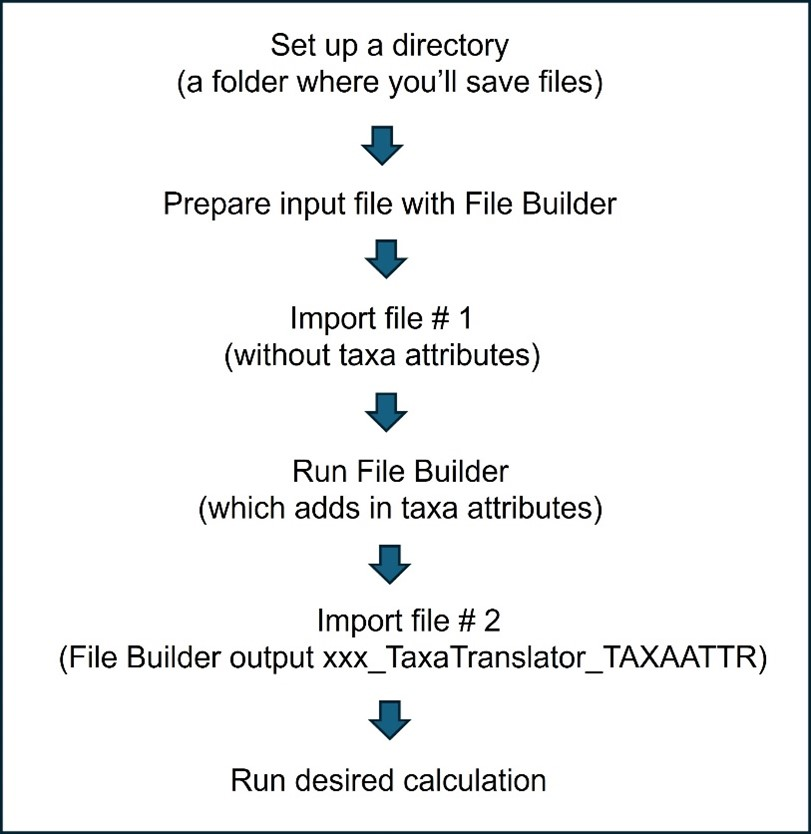

```{r setup, include=FALSE}
knitr::opts_chunk$set(echo = FALSE
                      , results = 'asis'
                      , warning = FALSE
                      , message = FALSE)
```

# Instructions, test files, and metadata

### Quick Tutorial [PDF]

### Example Input Files [<a href="https://github.com/leppott/MNcalc/raw/main/inst/apps/MNcalc/www/links/Test1Files_FileBuilder.zip" target="blank">ZIP</a>]

### Metadata

-   File Builder output files
    [<a href="https://github.com/leppott/MNcalc/raw/main/inst/apps/MNcalc/www/links/Metadata_FileBuilder_20240719.zip" target="blank">ZIP</a>]

-   BCG output files [ZIP]

-   IBI output files [ZIP]

### Workflow

{width="50%"}

#### [Prepare Data]{.underline}

**Create input file**. The input file can include data for multiple
samples, sites and Index Classes.

-   Input file requirements
    [<a href="https://github.com/leppott/MNcalc/raw/main/inst/apps/MNcalc/www/links/RequiredFields_FileBuilder_20240719.csv" target="blank">CSV</a>]

**Import file.**

**Select the desired Calculation and run the File Builder** (see
instructions on the File Builder page). The File Builder will join the
taxa names in the input file with the ‘original taxaID’ column in the
<a href="https://github.com/leppott/BioMonTools_SupportFiles/tree/main/data/taxa_official/MN" target="blank">Taxa
Translator table</a> and performs two functions:

-   Translate the original taxon name to the proper Operational
    Taxonomic Unit (OTU) for the calculation (for example, collapses
    worms to Oligochaeta).

-   Add in new columns with taxa attributes and hierarchy (e.g., Order,
    Family) that are needed for the metric calculations.

**Download and unzip the results**. A ‘results’ folder will appear, with
the following subfolders:

```{r table_req}
# Packages
library(readxl)
library(knitr)
library(kableExtra)
#library(DT)

# Data
fn <- "Instructions.xlsx"
path <- file.path("files", fn)
df <- read_excel(path, sheet = "Subfolders")

df %>%
  kable(escape = FALSE, format = "html") %>%
  kable_styling(full_width = F, position = "left")
```

In the subfolders for each calculation, there will be four File Builder
output files, described below.

```{r table_req2}
# Packages
library(readxl)
library(knitr)
library(kableExtra)
#library(DT)

# Data
fn <- "Instructions.xlsx"
path <- file.path("files", fn)
df <- read_excel(path, sheet = "FB_Output")

df %>%
  kable(escape = FALSE, format = "html") %>%
  kable_styling(full_width = F, position = "left")
```

When the File Builder has finished running, **a prompt box will
appear**. It will notify you if your File Builder run was successful or
failed. Or, in some cases (e.g., if there are problems with your input
file), the screen will gray out (meaning the Shiny app has crashed) and
you’ll have to refresh the app, investigate potential problems with your
input file, and try again.

If your run was successful, the prompt box will alert you if there are
taxa in your input file that don’t match with the taxa list in the Taxa
Translator table.

**What if there are non-matching taxa?** Open the
‘XXX_TaxaTranslator_nonmatch’ file and view the list of non-matching
taxa. If the non-matches are due to a misspelling, extra space or other
small issue, fix the non-matching taxa in your input file, re-upload the
file via the ‘Import File’ tab, and rerun the File Builder (and to
prevent confusion, delete the first set of output files with the
non-matching taxa). If the non-matching taxa are legitimate taxa that
need to be added to the Taxa Translator table, notify
[Jen.Stamp\@tetratech.com](mailto:Jen.Stamp@tetratech.com) and Tetra
Tech will update the Taxa Translator table as soon as resources permit.

Next, **import the newly created ‘XXX_TaxaTranslator_TAXAATTR’ file**.

#### [Calculation]{.underline}

**Go to the Calculation tab and run the selected calculation**.

Note: the default setting is for the R code to
<a href="https://github.com/leppott/MNcalc/raw/main/inst/apps/MNcalc/www/links/RedundantTaxa_20240719.pdf" target="blank">mark
redundant/non-distinct taxa</a>. If you want to use an alternate scheme,
uncheck the box, include your designations (TRUE/FALSE) in the input
file and name the column ‘EXCLUDE.’

The R code will perform the following steps:

BCG

1.  Mark non-distinct taxa (excluded from richness metrics)

2.  Calculate metric values for each sample

3.  Calculate BCG metric membership values for each sample

4.  Assign each sample membership in a BCG level

IBI

1.  Mark non-distinct taxa (excluded from richness metrics)

2.  Calculate metric values for each sample

3.  Calculate metric scores for each sample

4.  Calculate overall IBI score for each sample

**Download and unzip the results**. The files will be added to the
appropriate subfolder (depending on the Calculation). Note: you will
receive a prompt saying that the destination folder already contains the
‘XXX_TaxaTranslator_TAXAATTR’ file and asking if you’d like to replace
the existing file. Click ‘Yes to All.’

**Open the subfolder and view the outputs**.

List of BCG outputs.

```{r table_req3}
# Packages
library(readxl)
library(knitr)
library(kableExtra)
#library(DT)

# Data
fn <- "Instructions.xlsx"
path <- file.path("files", fn)
df <- read_excel(path, sheet = "BCG_Output")

df %>%
  kable(escape = FALSE, format = "html") %>%
  kable_styling(full_width = F, position = "left")
```

List of IBI outputs.

```{r table_req4}
# Packages
library(readxl)
library(knitr)
library(kableExtra)
#library(DT)

# Data
fn <- "Instructions.xlsx"
path <- file.path("files", fn)
df <- read_excel(path, sheet = "IBI_Output")

df %>%
  kable(escape = FALSE, format = "html") %>%
  kable_styling(full_width = F, position = "left")
```

Want more information on the BCG and IBI calculations? See the
References tab.

Having problems? See the Troubleshooting tab.

**Time saver tip:**

Some internet browsers, like Google Chrome and Mozilla Firefox, allow
you to change settings so that you can select which folder to download
files to (versus files going to the default Download folder).

-   Google Chrome file saving tip
    [<a href="https://tetratech-wtr-wne.shinyapps.io/ContDataQC_EPAtemplate/_w_18ec5e9f/GoogleChrome_TimesaverTips.pdf" target="blank">PDF</a>]

-   Mozilla Firefox: go to Settings \> General \> Files and Applications
    \> Check box for “always ask where to save files.”

#### [Merge Files]{.underline}

If you want to combine the BCG and IBI results into one file and have a
common identifier field in the two files (e.g., SampleID), use the
‘Merge files’ function under the Prepare Data tab.

------------------------------------------------------------------------

*Last updated 2024-07-12*
